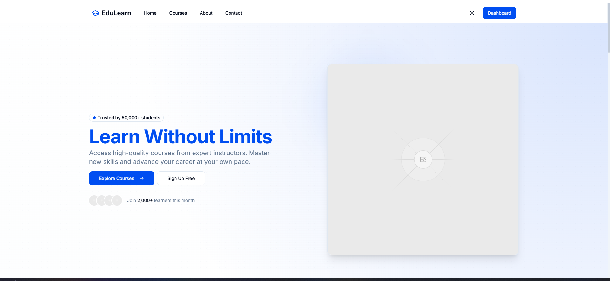
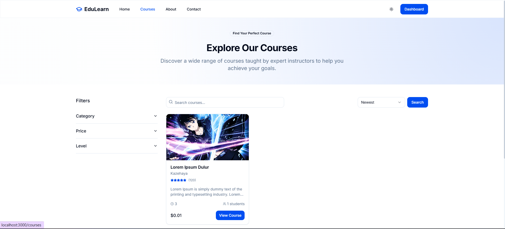
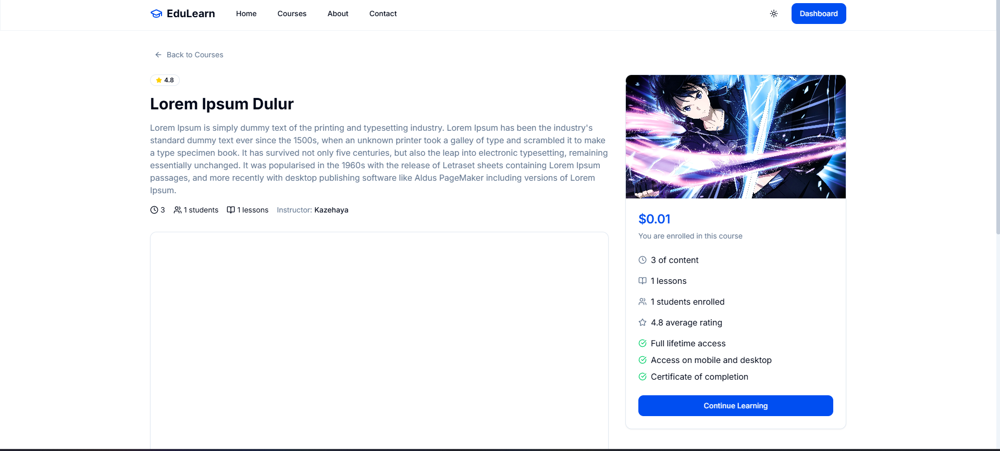

# Learning Management System

## Overview

This Learning Management System (LMS) is a web application built with Next.js and Supabase, designed to provide an efficient platform for managing educational content, courses, students, and instructors.

## Technologies Used

- **Next.js**: React framework for server-side rendering and static site generation
- **Supabase**: Open-source Firebase alternative with PostgreSQL database
- **React**: JavaScript library for building user interfaces
- **TypeScript**: Statically typed JavaScript for better developer experience

## Architecture

The LMS follows a modern web architecture with:

- **Frontend**: Next.js React application with TypeScript
- **Backend**: Serverless functions with Next.js API routes
- **Database**: PostgreSQL managed by Supabase
- **Authentication**: Supabase Auth with multiple providers
- **Storage**: Supabase Storage for files and media

## Features

- User authentication and authorization
- Course creation and management
- Content delivery
- Student progress tracking
- Assignment submissions
- Real-time notifications

# Screenshot
- Home

- Course

- Detail Course



## Getting Started

### Prerequisites

- Node.js (v14 or newer)
- npm or yarn
- Supabase account

### Installation

1. Clone the repository
```bash
git clone https://github.com/yourusername/lms.git
cd lms
```

2. Install dependencies
```bash
npm install
# or
yarn install
```

3. Set up environment variables
```
NEXT_PUBLIC_SUPABASE_URL=your-supabase-url
NEXT_PUBLIC_SUPABASE_ANON_KEY=your-supabase-anon-key
```

4. Run the development server
```bash
npm run dev
# or
yarn dev
```

## Project Structure

- `/pages`: Next.js pages
- `/components`: Reusable React components
- `/lib`: Utility functions and API calls
- `/styles`: CSS and styling files
- `/public`: Static assets

## Contributing

Contributions are welcome! Please feel free to submit a Pull Request.